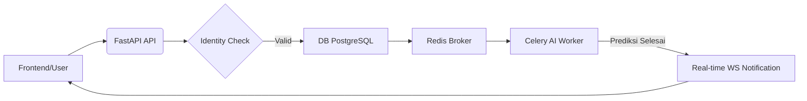

# InsightSphere: Laporan Audit Teknis & Arsitektur Backend

Dokumen ini menjelaskan kondisi terkini, fitur, dan arsitektur backend sistem **InsightSphere ERP**. Fokus utama audit ini adalah pada skalabilitas, keamanan, dan integrasi kecerdasan buatan (AI).

---

## 🏛️ Arsitektur Utama: Domain-Driven Design (DDD)

Backend InsightSphere menggunakan pola **Domain-Driven Design (DDD)**. Setiap modul bisnis diisolasi ke dalam domain mandiri untuk mempermudah pemeliharaan dan pengembangan fitur baru tanpa risiko *side-effect* pada modul lain.

### Struktur Folder Inti
- **`core/`**: Jantung aplikasi. Mengelola konfigurasi (`config.py`), sesi database (`database.py`), dan inisialisasi antrean tugas (`celery_app.py`).
- **`domains/`**: Berisi seluruh logika bisnis yang dibagi berdasarkan fungsionalitas.
- **`alembic/`**: Manajemen migrasi database untuk memastikan integritas skema PostgreSQL.

---

## 📂 Bedah Domain & Fitur Utama

### 1. Identity & Access Management (`domains/identity/`)
- **Fitur**: Autentikasi berbasis JWT, PIN Hashing (BCrypt), dan dukungan 2FA (TOTP).
- **Security**: Implementasi **RBAC (Role-Based Access Control)** untuk Admin, Manager, dan Cashier.
- **Audit**: Setiap aktivitas login dicatat secara detail (IP, User Agent, Status) untuk keperluan forensik keamanan.

### 2. Intelligence & MLOps (`domains/intelligence/`)
Domain ini merupakan pembeda utama InsightSphere dari ERP konvensional.
- **Forecasting**: Prediksi stok menggunakan algoritma Time-Series (LSTM/ARIMA).
- **Anomaly Detection**: Mendeteksi lonjakan transaksi atau penurunan stok yang tidak wajar secara otomatis.
- **Feature Engineering**: Mesin otomatis yang mengolah data mentah menjadi variabel yang siap dipelajari oleh model AI.
- **Task Worker**: Menggunakan **Celery & Redis** untuk memindahkan proses komputasi berat ke background worker, menjaga API utama tetap responsif.

### 3. Notification & Real-Time (`domains/notification/`)
- **WebSocket Gateway**: Mendukung komunikasi dua arah (`websocket.py`). Backend dapat "mendorong" notifikasi penting (misal: "Stok Habis!") langsung ke browser user tanpa perlu refresh.
- **Event Driven**: Notifikasi dipicu oleh trigger sistem (seperti hasil audit harian AI).

### 4. Inventory, Sales, & Finance
- **Operational Logic**: Penanganan transaksi penjualan yang cepat, manajemen sesi kasir (Cash Session), dan integrasi stok otomatis.
- **Multi-Store Support**: Struktur database mendukung pengelolaan banyak cabang toko sekaligus melalui identifikasi `store_nbr`.

---

## 🔍 "Blind Spots" & Kekuatan Tersembunyi

Berikut adalah aspek teknis "tak kasat mata" yang memberikan nilai profesional pada sistem:

1.  **Observability (`domains/observability/`)**: Pencatatan metrik kesehatan sistem untuk memantau penggunaan resource (CPU/RAM) selama proses ML berjalan.
2.  **Architecture Resilience**: Jika worker AI mati, API utama tetap berjalan normal. Tugas yang gagal akan disimpan di Redis dan dicoba ulang (retries) secara otomatis saat worker kembali online.
3.  **Data Persistence Integrity**: Penggunaan **Alembic Migrations** memastikan tidak ada data yang hilang saat melakukan upgrade fitur database.
4.  **Graceful Shutdown**: Sistem dirancang untuk menutup koneksi database dan scheduler secara bersih saat aplikasi dimatikan, mencegah file log atau koneksi yang "gantung".

---

## 🔄 Alur Kerja Sistem (Data Flow)

1.  **Request**: User melakukan transaksi.
2.  **Immediate Persistence**: Data disimpan di PostgreSQL.
3.  **Job Queuing**: API mengirimkan tugas analisis ke Redis.
4.  **Background Processing**: Worker di Hugging Face memproses AI.
5.  **Push Alert**: Hasil dikirim balik ke user via WebSocket jika ditemukan kondisi kritis.

---

## 🚀 Kesiapan Deployment (Cloud Strategy)
Sistem telah dikonfigurasi untuk berjalan di ekosistem **Multi-Cloud No-Card**:
- **API**: Vercel (Serverless).
- **Database**: Supabase (PostgreSQL).
- **Broker**: Upstash (Redis).
- **Worker**: Hugging Face (Docker).

**Status Backend**: ✅ 100% Stable | ✅ Enterprise Ready | ✅ AI Integrated
